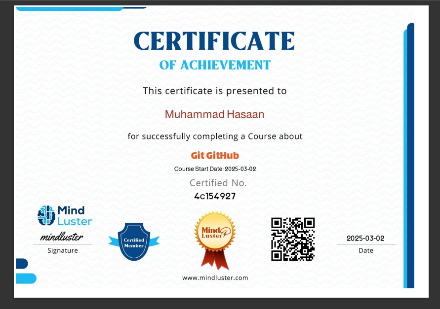
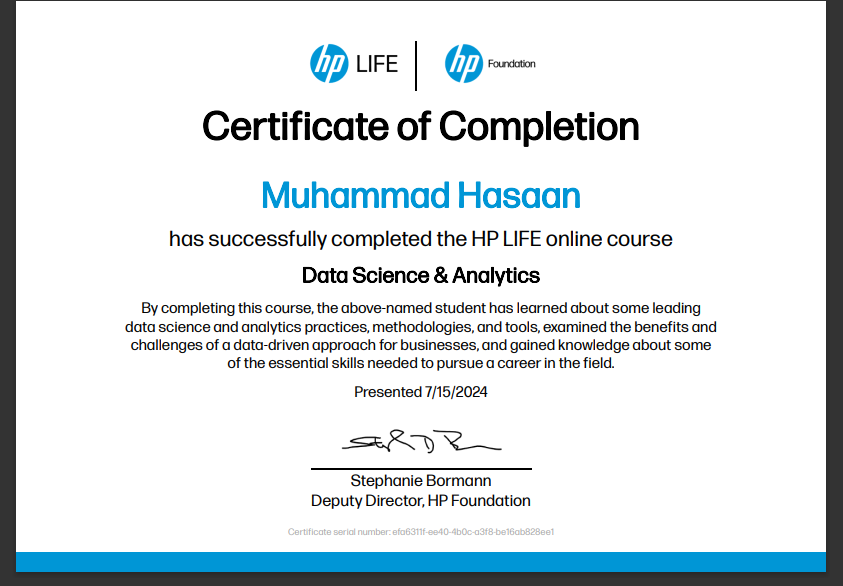

<h1>Hi, I'm Muhammad Hasaan!  
<a href="mailto:Hassaan70306@gmail.com">Developer</a>, 
<a href="https://www.linkedin.com/in/muhammad-hasaan-dev">DevOps Enthusiast</a>, 
<a href="https://github.com/hasaan1315">Tech Learner</a>, 
<a href="#">Cybersecurity Explorer</a>, 
<a href="#">Data Analytics Practitioner</a>, 
<a href="#">AI & ML Enthusiast</a>, 
<a href="#">Cloud Computing Explorer</a>
</h1>

<h2>👨‍💻 Software Development Projects:</h2>

- <b>MetroLink – Simplifying Urban Travel in Twin Cities (FYP)</b>  
  - <a href="https://github.com/hasaan1315/MetroLink-App" target="_blank">
    A Flutter-Firebase based public transport assistant featuring route planning, chatbot support, digital top-up, and lost item reporting.
    </a>

- <b>MetroLink Admin Dashboard (FYP)</b>  
  - <a href="https://github.com/hasaan1315/MetroLink-Admin-Dashboard" target="_blank">
    A responsive web-based admin panel to manage users, lost items, payments, alerts, and system security for the MetroLink app.
    </a>
    
- <b>Stock Images Marketplace Website</b>  
  - <a href="https://github.com/hasaan1315/Stock-Images-Marketplace-Website" target="_blank">
    A full-stack online marketplace for photographers and visual artists to showcase, license, and sell high-quality images.
    </a>

- <b>Online Voting System Mobile App</b>  
  - <a href="https://github.com/hasaan1315/Online-Voting-System-Mobile-App" target="_blank">
    Secure Android application for real-time mobile voting with Firebase authentication and admin-controlled polls.
    </a>

- <b>Bus Travel Management System</b>  
  - <a href="https://github.com/hasaan1315/Travel-Diaries-Online-Bus-Ticketing-System" target="_blank">
    OOP-based travel reservation and ticketing system in C++ for terminal-based booking and seat management.
    </a>

 

<h2>☁️ Cloud & Virtualization Projects:</h2>

- <b>Cloud Virtualization with Docker on AWS EC2</b>  
  - <a href="https://github.com/hasaan1315/Cloud-Virtualization-with-Docker-on-AWS-EC2" target="_blank">
    Docker container orchestration and deployment using Docker Swarm on Amazon EC2 for scalable microservice architecture.
    </a>

 

<h2>⚙️ DevOps & MLOps Projects:</h2>

- <b>MLflow Model Tracking & Deployment</b>  
  - <a href="https://github.com/hasaan1315/MLflow-Model-Tracking-Deployment-" target="_blank">
    A complete machine learning lifecycle project using MLflow for training, logging, versioning, and deploying a RandomForestClassifier on the Iris dataset.
    </a>

<h2>📜 Certifications:</h2>

- **Career Essentials in Cybersecurity – Microsoft & LinkedIn**  
  

- **Git & GitHub – Mind Luster**  
  

- **Data Science & Analytics – HP LIFE (HP Foundation)**  
  

<h2>🛠 Skills:</h2>

- **Languages:** C++, Java, HTML, CSS, JavaScript, PHP, SQL  
- **Tools & Technologies:** Docker, Firebase, AWS EC2, GitHub, VirtualBox, VMware  
- **Platforms:** Windows, Linux  
- **IDEs:** VS Code, Android Studio, Eclipse  
- **Soft Skills:** Communication, Teamwork, Problem Solving

<h2>📫 Connect with me:</h2>

[][linkedin]
[][github]
[][email]

 

[linkedin]: https://www.linkedin.com/in/muhammad-hasaan-dev  
[github]: https://github.com/hasaan1315  
[email]: mailto:Hassaan70306@gmail.com  

